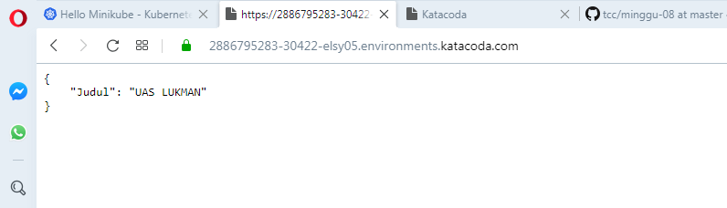

# KUBERNETES  
## Komponen-Komponen Kubernetes

## Komponen Master
Komponen master menyediakan control plane bagi klaster. Komponen ini berperan dalam proses pengambilan secara global pada klaster, serta berperan dalam proses deteksi serta pemberian respons terhadap events yang berlangsung di dalam klaster. Komponen master dapat dijalankan di mesin manapun yang ada di klaster, untuk memudahkan proses yang ada, script inisiasi awal yang dijalankan biasanya memulai komponen master pada mesin yang sama, serta tidak menjalankan kontainer bagi pengguna di mesin ini.

## Kube-apiserver

Komponen di master yang mengekspos API Kubernetes. Merupakan front-end dari kontrol plane Kubernetes. Komponen ini didesain agar dapat di-scale secara horizontal.

## etcd

Penyimpanan key value konsisten yang digunakan sebagai penyimpanan data klaster Kubernetes.

## kube-scheduler

Komponen di master yang bertugas mengamati pod yang baru dibuat dan belum di-assign ke suatu node dan kemudian akan memilih sebuah node dimana pod baru tersebut akan dijalankan.

Faktor-faktor yang diperhatikan dalam proses ini adalah kebutuhan resource secara individual dan kolektif, konstrain perangkat keras/perangkat lunak/peraturan, spesifikasi afinitas dan non-afinitas, lokalisasi data, interferensi inter-workload dan deadlines.

## kube-controller-manager

Komponen di master yang menjalankan kontroler.

Secara logis, setiap kontroler adalah sebuah proses yang berbeda, tetapi untuk mengurangi kompleksitas, kontroler-kontroler ini dikompilasi menjadi sebuah binary yang dijalankan sebagai satu proses. Kontroler-kontroler ini meliputi:

* Kontroler Node : Bertanggung jawab untuk mengamati dan memberikan respons apabila jumlah node berkurang.
* Kontroler Replikasi : Bertanggung jawab untuk menjaga jumlah pod agar jumlahnya sesuai dengan kebutuhan setiap objek kontroler replikasi yang ada di sistem.
* Kontroler Endpoints : Menginisiasi objek Endpoints (yang merupakan gabungan Pods dan Services).
* Kontroler Service Account & Token: Membuat akun dan akses token API standar untuk setiap namespaces yang dibuat.

# Membuat sebuah Deployment menggunakan Python+Flask

1. Membuat Docker images terlebih dahulu`lukmansl1994/imageuas:v1`
<pre>
lukmanPC@GATHOT-KOCO MINGW64 ~/Documents/tcc/minggu-09 (master)
$ docker images
REPOSITORY                   TAG                   IMAGE ID            CREATED
           SIZE
docker.test                  latest                37c59c1d3ea1        9 days ag
o          199MB
lukmansl1994/python-flask    v1                    37c59c1d3ea1        9 days ag
</pre>  
2. Install kubectl terlebih dahulu sesuai URL berikut `https://kubernetes.io/docs/tutorials/hello-minikube/`.  
<pre>
start.sh
$
$ start.sh
Starting Kubernetes...minikube version: v1.6.2
commit: 54f28ac5d3a815d1196cd5d57d707439ee4bb392
* minikube v1.6.2 on Ubuntu 18.04
* Selecting 'none' driver from user configuration (alternates: [])
* Running on localhost (CPUs=2, Memory=2461MB, Disk=47990MB) ...
* OS release is Ubuntu 18.04.3 LTS
* Preparing Kubernetes v1.17.0 on Docker '18.09.7' ...
  - kubelet.resolv-conf=/run/systemd/resolve/resolv.conf

* Pulling images ...
* Launching Kubernetes ...
* Configuring local host environment ...
* Done! kubectl is now configured to use "minikube"
* dashboard was successfully enabled
Kubernetes Started
</pre>  
3. Gunakan perintah kubectl create untuk membuat Deployment. Pod menjalankan Container berdasarkan image docker yang digunakan. Disini saya menggunakan image docker `lukmansl1994/python-flask:v1`. Pada Deployment ini Pod hanya memiliki 1 Container saja. `kubectl create deployment python-flask --image=lukmansl1994/python-flask:v1` .  
<pre>deployment.apps/python-flask created</pre>    
4. Melihat Deployment yang telah dibuat `kubectl get deployments`    
<pre>
$ kubectl get deployments
NAME        READY   UP-TO-DATE   AVAILABLE   AGE
luk-flask   1/1     1            1           7m52s
</pre>  
5. Melihat Pod yang tadi di buat `kubectl get pods`  
<pre>
$ kubectl get pods
NAME                         READY   STATUS    RESTARTS   AGE
luk-flask-7d7766557f-t5d6d   1/1     Running   0          6m47s
</pre>  
6. Melihat event yang terjadi pada cluster `kubectl get events`    
<pre>
$ kubectl get events
LAST SEEN   TYPE     REASON                    OBJECT                               MESSAGE
8m17s       Normal   Scheduled                 pod/luk-flask-7d7766557f-t5d6d       Successfully assigned default/luk-flask-7d7766557f-t5d6d to minikube
8m16s       Normal   Pulled                    pod/luk-flask-7d7766557f-t5d6d       Container image "lukmansl1994/imageuas:v1" already present on machine
8m16s       Normal   Created                   pod/luk-flask-7d7766557f-t5d6d       Created container imageuas
8m15s       Normal   Started                   pod/luk-flask-7d7766557f-t5d6d       Started container imageuas
8m17s       Normal   SuccessfulCreate          replicaset/luk-flask-7d7766557f      Created pod: luk-flask-7d7766557f-t5d6d
8m17s       Normal   ScalingReplicaSet         deployment/luk-flask                 Scaled up replica set luk-flask-7d7766557f to 1
21m         Normal   Starting                  node/minikube                        Starting kubelet.
21m         Normal   RegisteredNode            node/minikube                        Node minikube event: Registered Node minikube in Controller
21m         Normal   NodeHasSufficientMemory   node/minikube                        Node minikube status is now: NodeHasSufficientMemory
21m         Normal   NodeHasNoDiskPressure     node/minikube                        Node minikube status is now: NodeHasNoDiskPressure
21m         Normal   NodeHasSufficientPID      node/minikube                        Node minikube status is now: NodeHasSufficientPID
21m         Normal   NodeAllocatableEnforced   node/minikube                        Updated Node Allocatable limit across pods
21m         Normal   Starting                  node/minikube                        Starting kube-proxy.
21m         Normal   NodeReady                 node/minikube                        Node minikube status is now: NodeReady
21m         Normal   Scheduled                 pod/python-flask-6fcd775d57-7ntgc    Successfully assigned default/python-flask-6fcd775d57-7ntgc to minikube
21m         Normal   Pulling                   pod/python-flask-6fcd775d57-7ntgc    Pulling image "lukmansl1994/python-flask:v1"
20m         Normal   Pulled                    pod/python-flask-6fcd775d57-7ntgc    Successfully pulled image "lukmansl1994/python-flask:v1"
20m         Normal   Created                   pod/python-flask-6fcd775d57-7ntgc    Created container python-flask
20m         Normal   Started                   pod/python-flask-6fcd775d57-7ntgc    Started container python-flask
7m17s       Normal   Killing                   pod/python-flask-6fcd775d57-7ntgc    Stopping container python-flask
21m         Normal   SuccessfulCreate          replicaset/python-flask-6fcd775d57   Created pod: python-flask-6fcd775d57-7ntgc
21m         Normal   ScalingReplicaSet         deployment/python-flask              Scaled up replica set python-flask-6fcd775d57 to 1
$
</pre>  

# Membuat Service Untuk Menjalankan  
* Secara default, Pod hanya bisa diakses melalui alamat IP internal di dalam cluster Kubernetes. Supaya Container python-flask bisa diakses dari luar jaringan virtual Kubernetes, Maka harus ekspos Pod sebagai Service Kubernetes.  
1. Jalankan Pod pada internet publik menggunakan perintah `kubectl expose --type-LoadBalancer` digunakan untuk ekspos Service keluar dari Cluster. jalankan perintah `kubectl expose deployment luk-flask --type=LoadBalancer --port=5000` 
<pre>
$ kubectl expose deployment luk-flask --type=LoadBalancer --port=5000
service/python-flask exposed
</pre>  
2. Melihat Service yang di buat tadi dengan perintah `kubectl get services`  
<pre>
$ kubectl get services
NAME         TYPE           CLUSTER-IP      EXTERNAL-IP   PORT(S)          AGE
kubernetes   ClusterIP      10.96.0.1       <none>        443/TCP          16m
luk-flask    LoadBalancer   10.96.245.248   <pending>     5000:30422/TCP   8s
$
</pre>  
3. Sekarang jalankan pada Browser untuk melihat hasilnya.  
 
